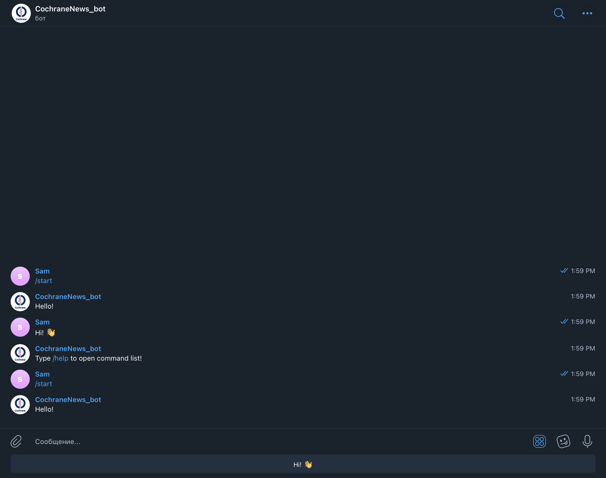
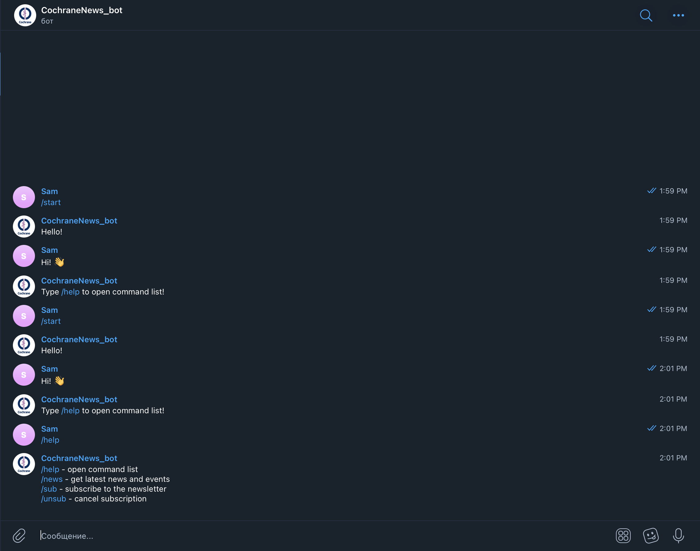
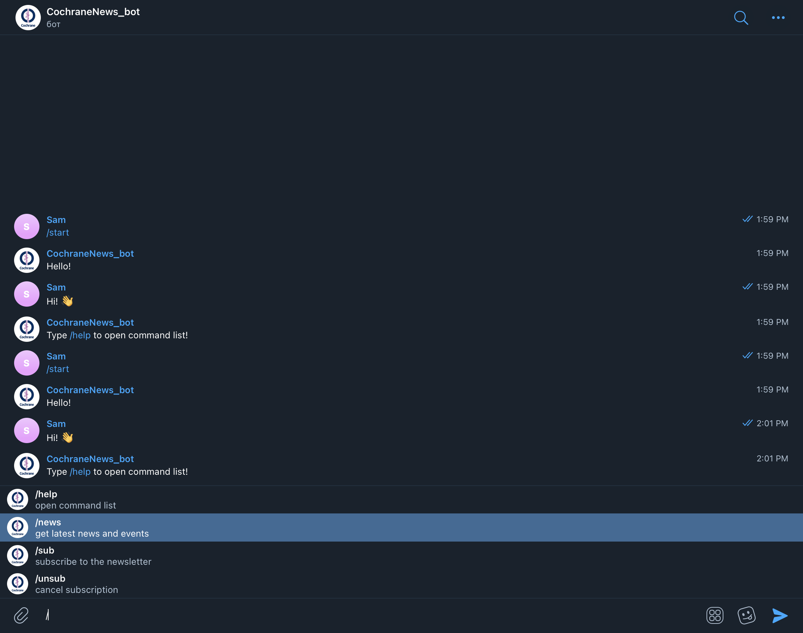
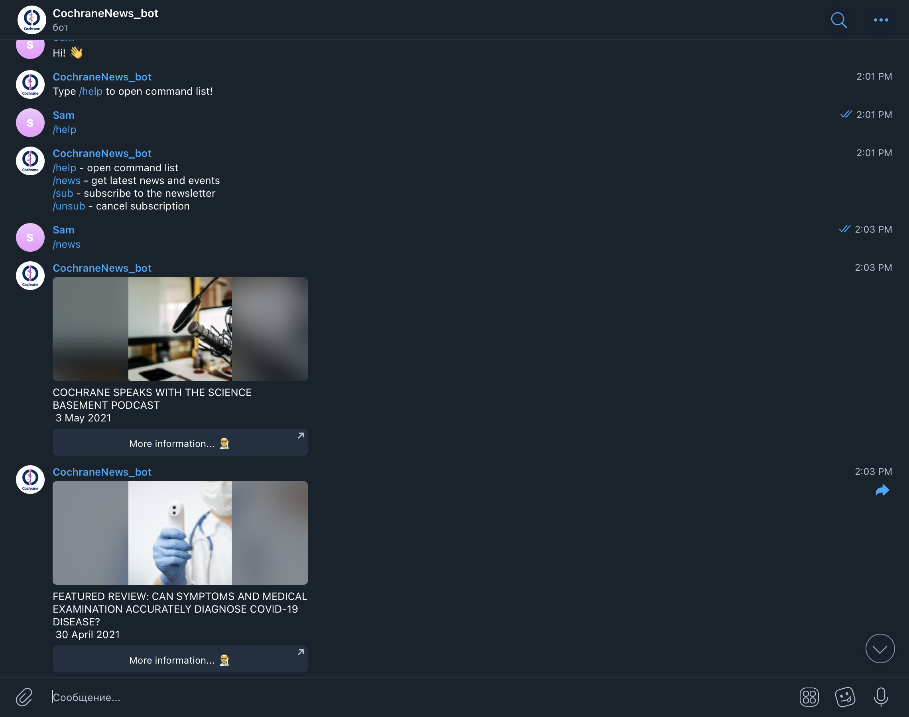
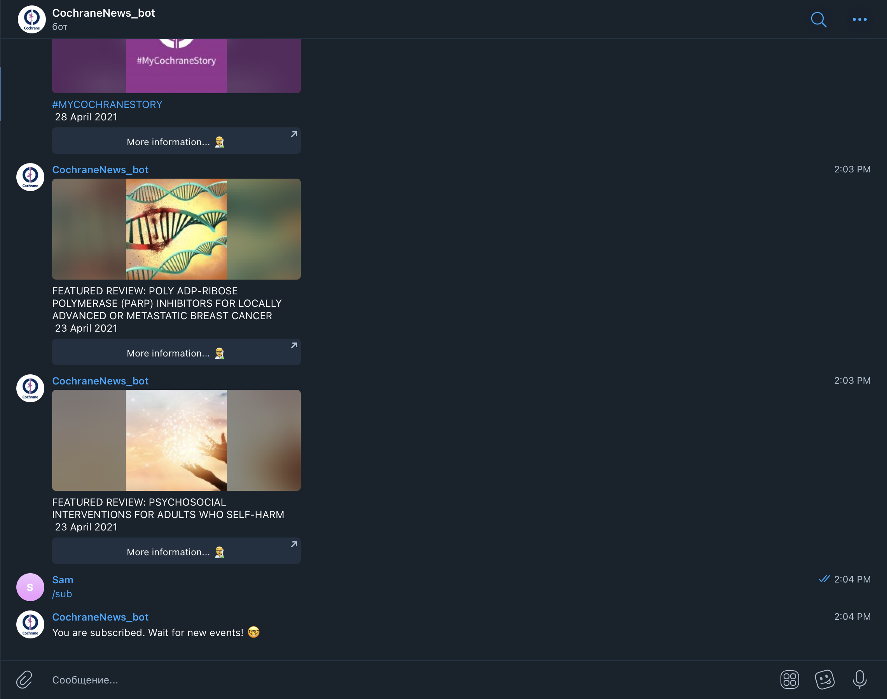
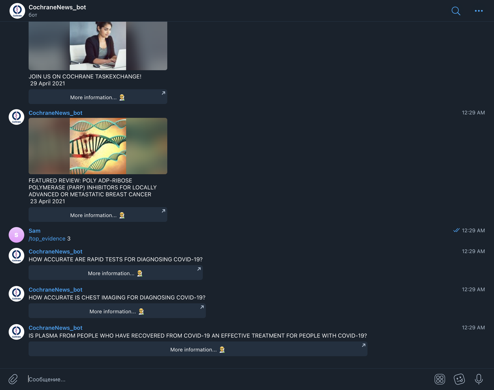

## **Cochrane-news-bot**

### **Description:**

*Cochrane-news-bot –– telegram bot whose goal is to collect latest news and events from medical portal Cochrane.org and send them to user.*

### **Commands:**

`/help` –– open command list

`/news` –– get latest news and events

`/sub` –– subscribe to the newsletter

`/unsub` –– cancel subscription

### **How to use:**

*Project is running on the server*

*Follow the link:* https://t.me/CochraneNews_bot

## **Example:**

​
​
​
​
​
​
